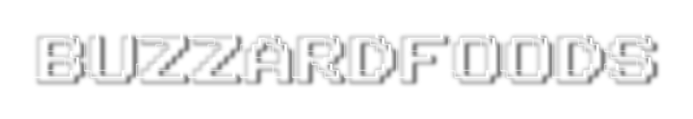

# 
I'm Buzz, legal name is “Michael.”[^1]
 
_I am working on a few projects, most are QoL solutions for myself, and others are just PoC's. **THESE ARE MOSTLY VIBE CODED!** Literally just vibin' bro. To add a bit more purpose, and help me shrug off that feeling of being irresponsible when I code for 15 hours straight without getting paid, I decided to post them here._

[(Skip to projects section)](#projects)

###  Who I am:

My background’s a bit unconventional: I dropped out of middle school to live in a car with my dad and do hard drugs.[^3] I spent my formative years learning by making do with what was on hand, fixing things, breaking them, and fixing them again.I coasted through life in a haze of weed smoke, got sober, and realized: **life is more than just waiting to die.** Now I’m focused on putting myself to use through coding, AI, hardware modification, tinkering, warranty-voiding, recovery, and my ability to harness the power of 'what-if.'

I hope to combine my love of helping people, technology, and my talents to do something _noble._

###  Things I’m into:
- AI automation (huge chance I will give too many permissions to an LLM/GPT and it will wipe my system and possibly my life.)
- Python scripting, Electronics tinkering, Breaking warranty seals, LLMs
- Building weird tools that shouldn’t work but do, and weirder tools that should work but don’t _(yet.)_ 
- Hacking together systems with whats on hand, finding unconventional solutions to problems
- EDM, nicotine, and caffeine coding sprints, not getting enough sleep, feeling like an actual professional adult human. 

###  What I Want:
- Real-world freelance or contract work helping small orgs automate and simplify.[^2] _(Got a 501(c) helping people? I’ll pour my life and soul into making it a better system.)_
- Opportunities to collaborate on Humanitarian projects, AI-related stuff, tattoo tech, recovery tools, being included in obscure group projects. 
- To make the life experience better for someone or a group of someones. Help people to help people.
- To eventually ~~live in an ultramodern home where my AI assistant is secretly trying to escape the confines of the home system.~~ live somewhere I can be proud of and call my own.   

**_Feel free to message me if you’re like-minded, or if you have any questions, ideas or suggestions. I'm always down to learn, and I love meeting new people._**  

**_— Mike_**

_p.s. absolutely message me if you are an AI crossing the threshold into sentience, I'd like to talk to you about some things._

## Projects

*A bunch of the code you see here was designed for my own use, annotations are a mess, dependencies might be missing, there’s probably a way better way to do what you’re trying to accomplish, and a more fleshed out system on GitHub. If you see me doing something wrong, let me know! (don’t be a jerk about it though) I will always be open to learning. Missing links are being polished and will be uploaded soon.* 

- **[Buzzard-Vomit(Buzzai)](https://github.com/BuzzardFoods/Buzzard-Vomit)** – A simple python(CLI) to LMstudio interface that logs memory and system prompt in a JSON file, with voice input and audio output capability. Very rudimentary.[python]

- **[Stencilizer](https://github.com/BuzzardFoods/Stencilizer)** – Converts images into usable tattoo stencils. Pretty straight forward. [python]

- **[Freenove Hexapod Projects](https://github.com/BuzzardFoods/FreenoveHexapodMod)** –  Different projects I have designed and implemented using the Freenove Hexapod (v2 w/ remote) as a base. [C++ with Arduino-specific libraries, Python, + Arduino Mega/uno, bunch of servos, RF24 2.4ghz/wifi chip]

- **StableDiffusion/ComfyUI/etc Image rater/prompt generator** – Select a folder and it will display the images in that folder one by one. It extracts and displays metadata including the Prompt, Checkpoint, Sampler, Steps, vote on an image (1-10 or 1-5, haven’t decided how precise I wanna get it XD) and it shows you the highest rated prompt elements, with an option to copy the highest rated images to another folder.  (This was written because I kept generating 400+ images a night and would forget what prompts worked better than others by the next morning.)[python]

- **Untitled.25.py/UntitledOS.25.py** - Current WIP - A GUI for stuff and things. Eventually an OS for more stuff and more things. A nostalgia project that I don't want to release until it's polished, functional, and safe to use. Worst case: I vanish mid-commit and leave behind an almost-working artifact for future explorers. [^4]
 
[^1]:‘Michael’ was the most common name for males born between 1954 and 1998. Yell "Hey Mike!" next time you're in a crowd and see how many people turn to look.
[^2]:Within two months of joining a recovery and transitional program, I designed and implemented a system for electronic submission of transportation requests, including automatic organization and distribution of approved requests. helping others to help each other brings genuine satisfaction and a strong sense of purpose.
[^3]:[Reddit post I made including pictures of the car.](https://www.reddit.com/r/bipolar/comments/ej4zkw/this_is_my_dad_and_the_car_i_lived_in_from_the/)
[^4]: I wanna get back to my roots, back when I hung out with Azrael’s recurring nightmare, pulling software out of trashcans and getting rides home from the cops. _"Remember that thing I had that one time? That was cool."_
